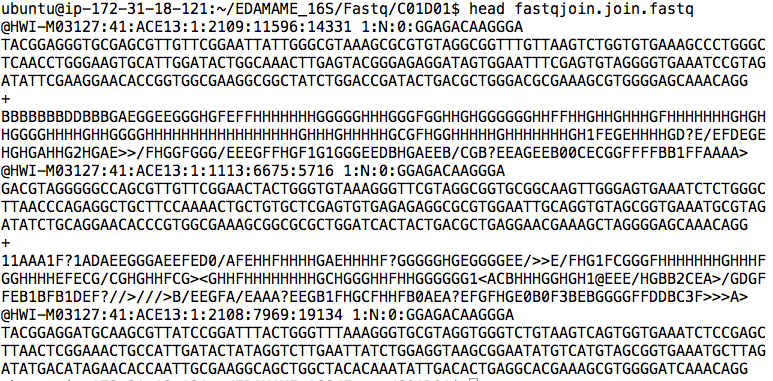
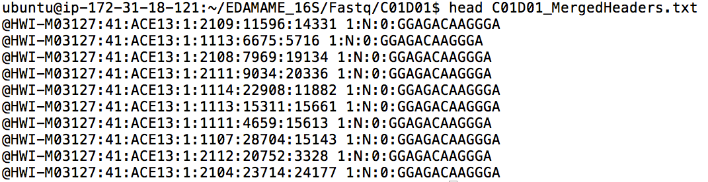
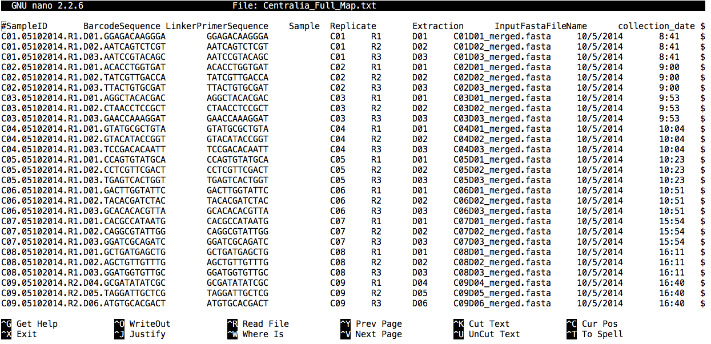
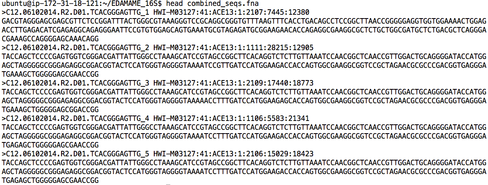

#Intro to QIIME for amplicon analysis
Authored by Ashley Shade, with contributions by Sang-Hoon Lee, Siobhan Cusack, Jackson Sorensen, and John Chodkowski.   
[EDAMAME-2016 wiki](https://github.com/edamame-course/2016-tutorials/wiki)

***
EDAMAME tutorials have a CC-BY [license](https://github.com/edamame-course/2015-tutorials/blob/master/LICENSE.md). _Share, adapt, and attribute please!_
***

##Overarching Goal
* This tutorial will contribute towards an understanding of **microbial amplicon analysis**

##Learning Objectives
* Install auxillary software on the QIIME EC2 image
* Subsample a large amplicon dataset for workflow development and tutorial testing
* Assemble paired-end reads
* Execute a shell script to automate a process
* Explore input and output files for QIIME workflows and scripts
* Understand the structure and components of a good mapping file
* Move sequences into the QIIME environment from an outside tool using "add_qiime_labels.py"
* Obtain summary information about sequence files (fasta, fna, fastq)
* Define operational taxaonomic units (OTUs)
* Execute a QIIME workflow, and understand the separate steps in the workflow
* Align sequences, assign taxonomy, and build a tree with representative sequences from OTU definitions

***

###Handout of workflow:
-  [Paired-End Illumina QIIME open-reference workflow](https://github.com/edamame-course/2015-tutorials/blob/master/QIIME_files/QIIME%20flow%20chart.pdf)

***

##1.1 Getting started
For this tutorial, we will be using the 16S sequencing data that we previously downloaded and unzipped. Let's connect to our EC2 instance, and then wget our data.
```
wget https://s3.amazonaws.com/edamame/EDAMAME_16S.tar.gz
tar -zxvf EDAMAME_16S.tar.gz
```

One we've done that, we'll navigate to the directory containing those files:
```
cd EDAMAME_16S/Fastq
```
You should see 108 files, all ending in .fastq.

## 1.2 Assembling Illumina paired-end sequences
These samples were sequenced using MiSeq 150 bp paired-end approach. Since the V4 region is only 253 bp our sequences should have ~50 bp of overlap. We can use this overlap to merge our 150 bp reads together to get the full 253 bp of the v4 region. Having longer reads gives us more information to work with when clustering reads into operational taxonomic units and for aligning these reads as well. The following steps go through how we accomplish this in QIIME.  

### 1.2.1 Assembling paired-end reads.

```
join_paired_ends.py -f C01D01F_sub.fastq -r C01D01R_sub.fastq -o C01D01
```
The previous command works by calling the python script `join_paired_ends.py` and having it act on the forward and reverse reads for sample C01D01.
### 1.2.2  Sanity check and file inspection.

There are some questions you may be having: What files does this return?  How many reads were successfully merged?

First let's take a look at what the outputs of `join_paired_ends.py`.

```
cd C01D01
ls -lah
```
You'll see three files here: `fastqjoin.join.fastq`, `fastqjoin.un1.fastq`, and `fastqjoin.un2.fastq`. `fastqjoin.join.fastq` contains all of the reads that were successfully merged, while `fastqjoin.un1.fastq` and `fastqjoin.un2.fastq` contain those reads which failed to merge form the forward and reverse files. Let's have a look at our merged sequences.

```
head fastqjoin.join.fastq
```

  

We see that the file is still in fastq format (ie there are 4 lines for each sequence beginning with a header line). We could go through an individually count every sequence that is there, or we could make use of `grep` and `wc` to automatically count.

```
grep  '@HWI' fastqjoin.join.fastq | wc -l
```
The above command actually works in two steps. Everything before the `|` is searching for the string `@HWI` in our merged reads file `fastq.join.fastq`. We search for `@HWI` because every sequence header will start with this. The command after the `|` counts the number of lines from the output in the first half of the command. Therefore the command counts every single header of the sequences in the merged file which equals the total number of merged sequences. We see that the program managed to merge 7670 sequences.

We can double check our sanity by using a positive control.  Let's investigate how many sequences there were in the original unmerged files.

```
grep '@HWI' ../C01D01F_sub.fastq | wc -l
```
This returns 10,000. So our the program managed to merged about 75% of the reads. Just in case you aren't convinced as to how this works lets go ahead and redirect the grep command to a new file instead of to the word count command.


```
grep '@HWI' fastqjoin.join.fastq > C01D01_MergedHeaders.txt
```

The `>` redirects the output of `grep` to a file instead of having every single result fly by on the screen. If you `head` the `C01D01_MergedHeaders.txt` file you'll see the following.


Then feel free to use `wc -l` on this file to check the number of lines. The `-l` command in `wc` signifies that we want to count every line instead of every word.  
```
wc -l C01D01_MergedHeaders.txt
```
The output is once again 7670. Hope you're convinced now!

Next, we are going to automate the previous process so we don't have to individually type in 54 lines of code. This means we need to clean up the directory for the sample we just did though. Move back a directory in the EDAMAME_16S/Fastq directory and execute the following command.  
```
rm -r C01D01
```

###1.2.3  Automate paired-end merging with a shell script.

We would have to execute an iteration of the `join_paired_ends.py` command for every pair of reads that need to be assembled. This could take a long time.  So, we'll use a [shell script](https://github.com/edamame-course/Amplicon_Analysis/blob/master/resources/Merged_Reads_Script.sh) to automate the task. You'll also need this [list](https://github.com/edamame-course/Amplicon_Analysis/blob/master/resources/list.txt) of file names.

To download the script and list onto the AMI, **first navigate to the "Fastq" directory**, use `curl` to get the files, and make a new `Merged_Reads` directory to put the merged reads into.

```
curl -O https://raw.githubusercontent.com/edamame-course/Amplicon_Analysis/master/resources/Merged_Reads_Script.sh
```
```
curl -O https://raw.githubusercontent.com/edamame-course/Amplicon_Analysis/master/resources/list.txt
mkdir Merged_Reads
```

Change permissions on the script to make it executable:
```
chmod 755 Merged_Reads_Script.sh
```

**Execute the script from the Fastq Directory**.  _Bonus_: A great opportunity to try [tmux](https://github.com/edamame-course/2015-tutorials/blob/master/final/2015-06-22_tmux.md)!

```
./Merged_Reads_Script.sh
```
_Bonus_: A little about this shell script
For those of you interested in how this script works I recommend you take a look at it either through your terminal with `less` or online [here](https://github.com/edamame-course/Amplicon_Analysis/blob/master/resources/Merged_Reads_Script.sh). The script uses a "for loop" to repeat a set of commands for every single pair of files we have. For each sample the script first performs the merging with `join_paired_ends.py` and saves the output to a directory with the name of the sample. Secondly, because of some weird naming conventions the `join_paired_ends.py` function follows, the script renames and moves the resulting merged read files to a single directory each with their own name. Finally, the script removes the original directory that `join_paired_ends.py` as a cleanup step. This gets rid of 54 unnecessary directories making saving our instance space and our eyes the strain of having to look at them all everytime we want to `ls` in the directory.  
###1.2.4  Sanity check #2.

How many files were we expecting from the assembly?  There were 54 pairs to be assembled, and we are generating one assembled fastq for each.  Thus, the Merged_reads directory should contain 54 files.  Navigate up one directory, and then use the `wc` (word count) command to check the number of files in the directory.

```
ls -1 Merged_Reads | wc -l
```

The terminal should return the number "54". Let's move this whole directory up one level so that we can access more easily with QIIME:
```
mv Merged_Reads ..
```

Congratulations, you lucky duck! You've assembled paired-end reads!  

  

##1.3 Understanding the QIIME mapping file

QIIME requires a [mapping file](http://qiime.org/documentation/file_formats.html) for most analyses.  This file is important because it links the sample IDs with their metadata (and, with their primers/barcodes if using QIIME for quality-control).

Let's spend few moments getting to know the mapping file.  Navigate to the MappingFiles subdirectory in the EDAMAME_16S/MappingFiles directory.

```
nano Centralia_Full_Map.txt
```
**Warning** We are using the text editor `nano` to look at the mapping file because it easier to view. However, as the description implies, you can use `nano` to alter files. Just make sure you exit the program without saving any chances by pressing `ctrl+x`. If you have made changes to the fils it will ask you if you want to save them, you do not, so type `N` and `enter`.


A clear and comprehensive mapping file should contain all of the information that will be used in downstream analyses.  The mapping file includes both categorical (qualitative) and numeric (quantitative) contextual information about a sample. This could include, for example, information about the subject (sex, weight), the experimental treatment, time or spatial location, and all other measured variables (e.g., pH, oxygen, glucose levels). Creating a clear mapping file will provide direction as to appropriate analyses needed to test hypotheses.  Basically, all information for all anticipated analyses should be in the mapping file.

*Hint*:  Mapping files are also a great way to organize all of the data for posterity in the research group, and can provide a clear framework for making a [database](http://swcarpentry.github.io/sql-novice-survey/).  New lab members interested in repeating the analysis should have all of the required information in the mapping file.  PIs should ask their students to curate and deposit both mapping files and raw data files.

Guidelines for formatting map files:
  - Mapping files should be tab-delimited
  - The first column must be "#SampleIDs" (commented out using the `#`).
  -  SampleIDs are VERY IMPORTANT. Choose wisely! Ideally, a user who did not design the experiment should be able to distinguish the samples easily. In QIIME, SampleIDs must be alphanumeric characters or periods.  They cannot have underscores.
  - The last column must be "Description".
  - There can be as many in-between columns of contextual data as needed.
  - If you plan to use QIIME for demultiplexing (which we do not need because the our reads already came demultiplexed from the facility), the BarcodeSequence and LinkerPrimer sequence columns are also needed, as the second and third columns, respectively.
  - Excel can cause formatting heartache.  See more details [here](https://github.com/edamame-course/docs/blob/gh-pages/extra/QIIME_Tutorial/MapFormatExcelHeartAche.md).

##1.4  Getting assembled reads into the one big ol' data file, and extracting summary information

QIIME expects all of the data to be in one file, and, currently, we have one separate fastq file for each assembled read.  We will add labels to each sample and merge into one fasta file using the `add_qiime_labels.py` script. Documentation is [here](http://qiime.org/scripts/add_qiime_labels.html).

Navigate back to the EDAMAME_16S/ directory, then execute the following command:

```
add_qiime_labels.py -i Merged_Reads/ -m MappingFiles/Centralia_Full_Map.txt -c InputFastaFileName -n 1
```
Inspect the new file "combined_seqs.fna."

```
head combined_seqs.fna
```

  


Observe that QIIME has added the SampleIDs from the mapping file to the start of each sequence.  This allows QIIME to quickly link each sequence to its sampleID and metadata.

While we are inspecting the combined_seqs.fna file, let's confirm how many sequences we have in the dataset.

```
count_seqs.py -i combined_seqs.fna
```

Looks like we have right around 442,289 sequences. This is a nice QIIME command to call frequently, because it provides the total number of sequences in a file, as well as some information about the lengths of those sequences.  But, suppose we wanted to know more than the median/mean of these sequences?

Another trick with QIIME is that you can call all the mothur commands within the QIIME environment, which is very handy.  mothur offers a very useful command called `summary.seqs`, which operates on a fasta/fna file to give summary statistics about its contents.

```
mothur
```

```
summary.seqs(fasta=combined_seqs.fna)
```

Note that both summary.seqs and count_seqs.py have returned the same total number of seqs in the .fna file (442,289).  Use the following command to quit the mothur environment and return to QIIME.  

```
quit()
```


##1.5  Picking Operational Taxonomic Units, OTUs.
###1.5.1  Preamble
Picking OTUs is sometimes called "clustering," as sequences with some threshold of identity are "clustered" together to into an OTU.

  _Important decision_: Should I use a de-novo method of picking OTUs or a reference-based method, or some combination? ([Or not at all?](http://www.mendeley.com/catalog/interpreting-16s-metagenomic-data-without-clustering-achieve-subotu-resolution/)). The answer to this will depend, in part, on what is known about the community a priori.  For instance, a human or mouse gut bacterial community will have lots of representatives in well-curated 16S databases, simply because these communities are relatively well-studied.  Therefore, a reference-based method may be preferred.  The limitation is that any taxa that are unknown or previously unidentified will be omitted from the community.  As another example, a community from a lesser-known environment, like Mars or a cave, or a community from a relatively less-explored environment would have fewer representative taxa in even the best databases.  Therefore, one would miss a lot of taxa if using a reference-based method.  The third option is to use a reference database but to set aside any sequences that do not have good matches to that database, and then to cluster these de novo.

  For this tutorial, we are going to use an OTU-picking approach that uses a reference to identify as many OTUs as possible, but also includes any "new" sequences that do not hit the database.  It is called "open reference" OTU picking, and you can read more about it in this [paper](https://peerj.com/articles/545/) by Rideout et al.  Discussion of the workflow by the QIIME developers is [here](http://qiime.org/tutorials/open_reference_illumina_processing.html.).

We use the QIIME workflow command: `pick_open_reference_otus.py` for this step.  Documentation is [here](http://qiime.org/scripts/pick_open_reference_otus.html).
The default QIIME 1.9.1 method for OTU picking is uclust, which we use here for simplicity's sake.  However, we encourage you to explore different OTU clustering algorithms to understand how they perform.  They are not created equal.

###1.5.2 OTU picking

This next step will take about 45 minutes. _Bonus_: A great opportunity to try [tmux](https://github.com/edamame-course/2015-tutorials/blob/master/final/2015-06-22_tmux.md)!

Before continuing, make sure you are in the "EDAMAME_16S" directory.

```
pick_open_reference_otus.py -i combined_seqs.fna -o uclust_openref/ -f
```

In the above script:
  - We tell QIIME to look for the input file `-i`, "combined_seqs.fna".
  - We specify that output files should go in a new folder, uclust_openref/
  - We tell the program to overwrite already-existing files in the folder if we are running this program more than once (-f)

  Other default parameters of interest:
   - Singletons are removed from the OTU table (default flag --min_otu_size)
   - Alignment is performed with [PyNAST](http://www.ncbi.nlm.nih.gov/pmc/articles/PMC2804299/)
   - Taxonomy is assigned with [uclust](http://qiime.org/scripts/assign_taxonomy.html?highlight=assign_taxonomy)
   - Default workflow values can be changed using a [parameter file](http://qiime.org/documentation/qiime_parameters_files.html?highlight=parameter)
   - We do not perform prefiltering, as per the recommendations of [Rideout et al.](https://peerj.com/articles/545/)

###1.5.3  Exploring results from OTU picking workflow
#####"Steps" from open reference picking

In uclust_openref/, we can see several new directories and files.  Let's explore them, starting with the "step1.." directories.  As the [documentation for pick_open_reference_otus.py](http://qiime.org/scripts/pick_open_reference_otus.html) explains:
  1. *Step 1* picks OTUs based on a [reference database](http://greengenes.lbl.gov/cgi-bin/nph-index.cgi), producing a file of successfully clustered OTUs and a file of sequences that failed to cluster based on the reference database.
  2. *Step 2* performs computationally expensive de novo clustering for a subset of the failed sequences from step 1, and picks a representative sequence from each new cluster to add to the original database.
  3. *Step 3* picks OTUs from all of the failed sequences, not just the subset used in step 2, based on the new database generated (of ref+ de novos) in step 2.
  4. *Step 4* performs de novo clustering on all remaining OTUs.

  An great overview of the steps of the open-reference process is provided by Figure 1 of Rideout et al. 2014.


If you navigate into one of the "step" directories, you will see a series of output files, including representative sequences of OTU clusters ("rep_set").  Take your time to explore these files using the `head` or `less` commands.  Then, navigate back to the uclust_openrefs directory.

What are the other directories?  The open reference OTU picking also automatically takes the next steps towards building the OTU table.  The pynast_aligned_seqs directory and the uclust_assigned_taxonomy each have outputs and logs from alignments and taxonomic assignment, respectively.  Notice that the directories are named so that the algorithm/tool used to perform the task is provided (e.g., pynast was used for alignment, uclust was used for taxonomy).  Very smart!


#####Alignment output
Navigate into the pynast_aligned_seq directory directory.  There are four files waiting there:  one file of sequences that failed to align, one of sequences that did align, one of "pre-alignment" files, and a log file.  Inspect each.  

If you want to build a tree with some other out-of-QIIME software, this is where you would find the rep_set alignment.  The log file provides a rep-sequence by rep-sequence report.  If you needed align sequences as an independent step, you would use `align_seqs.py`; documentation [here](http://qiime.org/scripts/align_seqs.html?highlight=align_seqs).


How many failed alignments were there?   
```
count_seqs.py -i rep_set_failures.fasta
```

We see that there were 690 rep. sequences that failed to align, and approximately 22,206 that did.  (Also, notice what short-read alignments generally look like...not amazing).

*Sanity check?*  If you like, [BLAST](http://blast.ncbi.nlm.nih.gov/Blast.cgi?PAGE_TYPE=BlastSearch&BLAST_SPEC=MicrobialGenomes) the top sequence that failed to align to convince yourself that it is, indeed, a pitiful failure.

If, in the future, you ever have a large proportion of rep seqs that fail to align, it could be due to:
  *  Hooray! These are novel organisms! (But, think about the novelty of the habitat before jumping to conclusions.)
  *  The alignment parameters were too stringent for short reads, causing "real" sequences to fail alignment.
  * The paired-end merger algorithm (e.g., join_paired_ends.py) did not do a perfect job, and concatenated ends that do not belong together.
  * Some combination of the above, as well as some other scenarios.

The failed-to-align sequences are filtered automatically with this QIIME otu-picking workflow (really, the removing the entire OTU cluster that they represent); the filtered results are in the otu_table_mc2_w_tax_no_pynast_failures.biom file.

#####Taxonomy files
Move up a directory and then cd into the uclust_assigned_taxonomy directory.

```
more rep_set_tax_assignments.txt
```
In the "taxonomy" directory, you will find a log file and the specific taxonomic assignments given to each representative sequence, linked to the OTU ID of that representative sequence

#####Other Very Important Files in uclust_openref/
######OTU map
```
nano final_otu_map.txt
```
Explore this file.  It links the exact sequences in each sample to its OTU ID. You should see an OTU ID (starting with the number of the first OTU that was picked) in the the left most column.  After that number, there is a list of Sequence IDs that have been clustered into that OTU ID.  The first part of the sequence ID is the SampleID from which it came, and the second part is the sequence number within that sample.  


You will notice that some files have "mc2" appended to them. "mc2" designates that the minimum count of sequences for any particular OTU was 2.  In other words, that file has singleton OTUs already filtered out.  

Sanity check: How can you compare the OTUs in the full dataset versus the singletons-omitted dataset?


######Biom-formatted OTU tables
These tables have the extension ".biom"  There are lots of [important resources](http://biom-format.org/) for understanding and working with the "biome" formatted tables, which were developed to deal with very large, sparse datasets, like those for microbial communities.  There are several versions - some omitting singletons (mc2), some containing taxonomic assignment of otus (w_tax), some omitting alignment failures (no_pynast_failures). Biom-formatted tables are actually a binary file, so looking at it with `less` or `more` won't be informative.  

######Representative sequences (one from each OTU)
```   
more rep_set.fna
```
This is not an alignment, but the list of representative sequences used to assign taxonomy to the OTU, to make the alignment, and to build the tree.

######Phylogenetic tree
```
more rep_set.tre
```
You can import this tree into any tree-visualization software that accepts the .tre extension ([Newick](http://marvin.cs.uidaho.edu/Teaching/CS515/newickFormat.html) format).  This is made from from an alignment of representative sequences (in the pynast directory).  The OTU ID is given first, and then the branch length to the next node. This format is generally compatible with other tree-building and viewing software. For example, I have used it to input into the [Interactive Tree of Life](http://itol.embl.de/) to build visually appealing figures. [Topiary Explorer](http://topiaryexplorer.sourceforge.net/) is another option for visualization, and is a QIIME add-on.

######Log files
Open them up!  You will be delighted!  It has all of the information you ever wanted to know about the parameters and tools you've just used for your workflow analysis!  _Hint_:  most of this information is needed when writing the methods sections of manuscripts using sequencing data.


##*Congratulations!  You just had the QIIME of Your Life!*

  

#Resources and help
## QIIME
  - [QIIME](qiime.org) offers a suite of developer-designed [tutorials](http://www.qiime.org/tutorials/tutorial.html).
  - [Documentation](http://www.qiime.org/scripts/index.html) for all QIIME scripts.
  - There is a very active [QIIME Forum](https://groups.google.com/forum/#!forum/qiime-forum) on Google Groups.  This is a great place to troubleshoot problems, responses often are returned in a few hours!
  - The [QIIME Blog](http://qiime.wordpress.com/) provides updates like bug fixes, new features, and new releases.
  - QIIME development is on [GitHub](https://github.com/biocore/qiime).
  - Remember that QIIME is a workflow environment, and the original algorithms/software that are compiled into QIIME must be referenced individually (e.g., PyNAST, RDP classifier, FastTree etc...)

## Biom format
  - [Motivation and documentaiton](http://biom-format.org/)
  - [Coming-out paper McDonald et al. 2012](http://www.gigasciencejournal.com/content/1/1/7)
  - [GitHub](https://github.com/biocore/biom-format)

-----------------------------------------------
-----------------------------------------------
